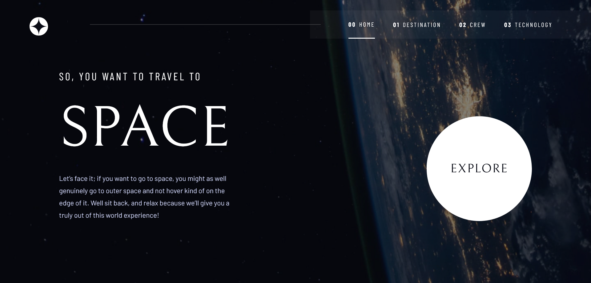

# Frontend Mentor - Space tourism website solution

This is a solution to the [Space tourism website challenge on Frontend Mentor](https://www.frontendmentor.io/challenges/space-tourism-multipage-website-gRWj1URZ3). Frontend Mentor challenges help you improve your coding skills by building realistic projects.

## Table of contents

-   [Overview](#overview)
    -   [The challenge](#the-challenge)
    -   [Screenshot](#screenshot)
    -   [Links](#links)
-   [My process](#my-process)
    -   [Built with](#built-with)
    -   [What I learned](#what-i-learned)
    -   [Useful resources](#useful-resources)
-   [Author](#author)

## Overview

### The challenge

Users should be able to:

-   View the optimal layout for each of the website's pages depending on their device's screen size
-   See hover states for all interactive elements on the page
-   View each page and be able to toggle between the tabs to see new information

### Screenshot



### Links

-   Solution URL: [Frontend Mentor](https://www.frontendmentor.io/solutions/space-tourism-using-nextjs-and-typescript-2qMRhrP2fk)
-   Live Site URL: [Space Tourism](https://space-tourism-ayo.vercel.app)

## My process

### Built with

-   Semantic HTML5 markup
-   CSS custom properties
-   Flexbox
-   CSS modules
-   Mobile-first workflow
-   [React](https://reactjs.org/) - JS library
-   [Next.js](https://nextjs.org/) - React framework
-   [Swiper](https://swiperjs.com/) - For styles


### What I learned

A couple of things I learned while working on this project:

1. Full-page background image using Next.js Image component.

```css
/* Full-page background image styles (done this way so as to use Next's image component for optimization) */
.bgImageWrapper {
  position: fixed;
    top: 0;
    bottom: 0;
    height: 100vh;
    width: 100vw;
    overflow: hidden;
    z-index: -1;

    filter: contrast(0.8) brightness(0.5); /* not required */
}
```

<!-- Corresponding JavaScript code -->

```tsx
<div className='bgImageWrapper'>
    <Image src='/path-to-image' alt='' quality={100} sizes='100vw' fill />
</div>
```

2. Using Next.js Image component to allow variable sizes without using `fill` prop.

```tsx
<div>
    <Image
        className={`${styles.img} ${styles.imgMobile}`}
        src='/path-to-image'
        alt=''
        width={0}
        height={0}
        style={{ width: '100%', height: 'auto' }}
        sizes='(max-width: 768px) 100vw, (max-width: 1200px) 50vw, 33vw'
    />
</div>
```

The image can then be styled using CSS, as for normal images.

### Useful resources

-   [Using Swiper in React](https://swiperjs.com/blog/using-swiper-element-in-react)
-   [Styling Swiper web components in React](https://dev.to/ivadyhabimana/customizing-swiperjs-prevnext-arrow-buttons-and-pagination-bullets-in-react-3gkh) - Really timely article which helped me understand why CSS styles are handled differently in Swiper web components.
-   [CSS list counters](https://css-tricks.com/almanac/properties/c/counter-set/) 
-   [Workaround for using Next's Image component without providing width or height properties](https://github.com/vercel/next.js/discussions/18474#discussioncomment-5501724) - Didn't use the fill prop and the images were dynamically generated had variable sizes (this solution causes Cumulative Layout Shift)

## Author

-   Frontend Mentor - [@ayobami11](https://www.frontendmentor.io/profile/ayobami11)
-   Twitter - [@TunwaseAyobami](https://www.twitter.com/TunwaseAyobami)

